# codec-cors-credentials

## Overview
This repository contains an implementation of a Temporal [Codec Server](https://docs.temporal.io/codec-server) that 
supports [Cross-Origin Resource Sharing](https://developer.mozilla.org/en-US/docs/Web/HTTP/CORS) (CORS), and specifically CORS [Requests with credentials](https://developer.mozilla.org/en-US/docs/Web/HTTP/CORS#requests_with_credentials).

## Background
When a Codec Server is configured within the Temporal UI, the Temporal UI code, executed by the browser, will make JavaScript `XMLHTTPRequest` (XHR) or `Fetch` requests to the Codec Server's `/decode` endpoint to decode the encoded payloads in the Workflow history.

By default, in cross-origin Fetch/XHR invocations, browsers will **not** send credentials. Therefore, if the Codec Server requires authentication, *AND* the user has successfully logged in to the Codec Server, (by default) the browser will not send the authentication cookie with the request to the Codec Server. 

In order to send the authentication cookie, a specific flag has to be set on the XMLHttpRequest object (flag: `withCredentials = true`) or the Request constructor (flag: `credentials = 'include'`) when it is invoked.

The configuration option within the Temporal UI to set the appropriate flag is "**Include cross-origin credentials**", which can be found in the Codec Server settings.

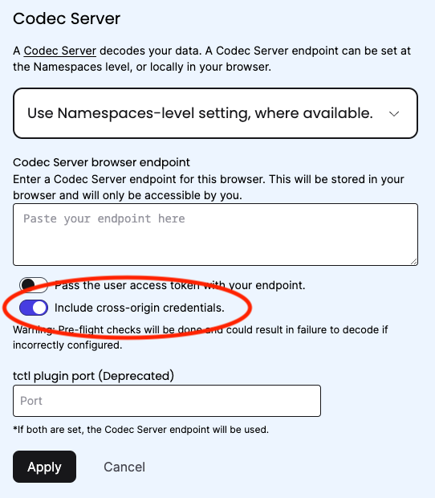


Once "**Include cross-origin credentials**" is enabled in the settings, Temporal will send the credentials (e.g. the authentication cookie) to the Codec Server with all XHR/Fetch requests to the `/decode` endpoint.  

In addition to the XHR/Fetch client requiring configuration to send credentials, the Codec Server must also be configured to:
1. Set the Cookie with the appropriate attributes (e.g. `SameSite=None; Secure`)
2. Accept the Cookie and return a response with the appropriate CORS headers (e.g. `Access-Control-Allow-Credentials: true`)

These requirements are implemented in this Codec Server.

## Implementation

The core code for this Codec Server comes from two sources:
1. The Go Regular Web App example from Auth0: https://auth0.com/docs/quickstart/webapp/golang
2. The Go Encryption Codec example from Temporal samples: https://github.com/temporalio/samples-go/tree/main/encryption

### Auth0 setup

The full details of the Auth0 setup are beyond this guide, but the key steps were:
* Create a "Codec Server" application, with the default options, and extended options of:
    * Allowed Callback URLs: `https://localhost:3000/callback`
    * Allowed Logout URLs: `https://localhost:3000`
* Create a role "Decryptor" 
* Create 2 users "alice" (with the "Decryptor" role) and "bob" (without).
* Create a custom Action to set the roles as custom claims in the JWT token.
* Create a custom Login Flow to invoke the action as a Login/Post Login step.

### Temporal setup

* Create a namespace in Temporal Cloud (or your Temporal Cluster of choice)
* Run the `worker` and `starter` steps (#3 and #4 respectively) from the [Go Encryption sample](https://github.com/temporalio/samples-go/tree/main/encryption)
    * If running in Temporal Cloud, the `worker` and `starter` will require slight modification to connect over mTLS (as shown in the [helloworldmtls](https://github.com/temporalio/samples-go/tree/main/helloworldmtls) sample)

### Codec Server setup

In order for the Codec Server to set a `SameSite=None` cookie it must run securely with `https`, therefore:
* Generate a self-signed TLS certificate and key, and save them as `tls.crt` and `tls.key` in the `certs` directory of this repo (this directory is ignored by git).

Set the following environment variables in the terminal where you will run the Codec Server:
* AUTH0_CLIENT_ID=\<your auth0 client id\>
* AUTH0_DOMAIN=\<your auth0 domain\>
* AUTH0_CLIENT_SECRET=\<your auth0 client secret\>
* AUTH0_CALLBACK_URL=https://localhost:3000/callback
* TEMPORAL_ORIGIN_URL=https://cloud.temporal.io (if using Temporal Cloud)

### Start the Codec Server
```bash
go run main.go
```

## Testing

### Codec Server with Bob
Open https://localhost:3000 and login with Bob, who is not authorized to decode the encrypted payloads:

#### Home page:

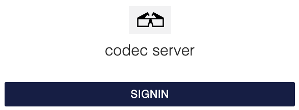

#### Login as Bob:

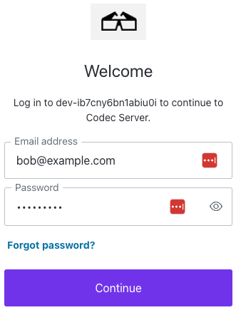

#### Bob is authenticated, but not in the "Decryptor" role:

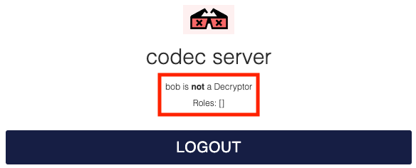

### Temporal UI
Open https://cloud.temporal.io in the same browser, and navigate to the namespace where the `encryption` sample is running.

#### Workflow View with Encrypted Payloads

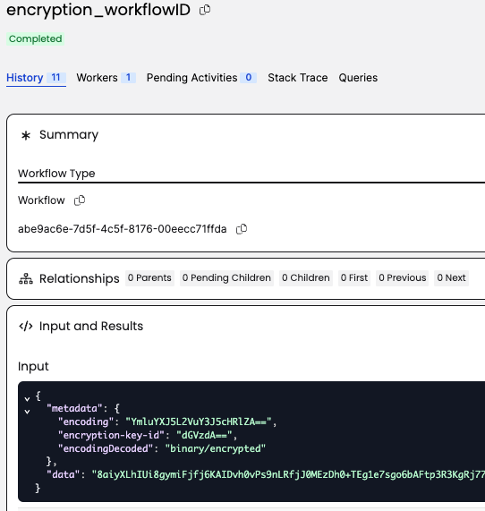

#### Configure the Codec Server without Credentials

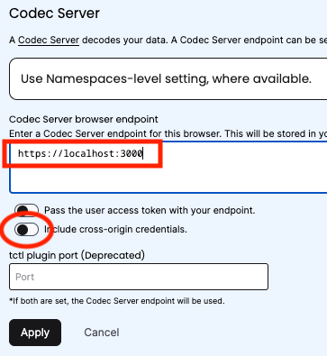

The Temporal UI will attempt to decode the payloads, but will fail with a **401 Unauthorized** error, as the Cookie credential is **not** being sent to the Codec Server. Note that there is no Cookie header in the request to the Codec Server.

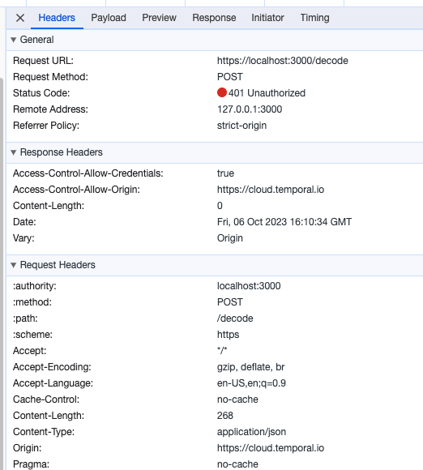

#### Reconfigure the Codec Server with Credentials

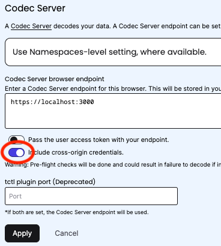

The Temporal UI will attempt to decode the payloads, but will fail with a **403 Forbidden** error. The Cookie credential **is** being sent to the Codec Server, but the Codec Server rejects the request as Bob is not in the Decryptor role.

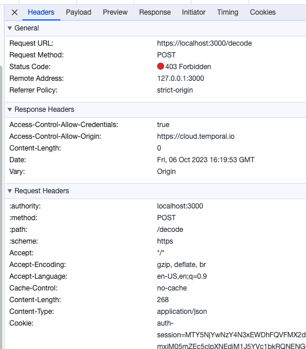

### Codec Server with Alice
Logout of the Codec Server and re-login with Alice, who is authorized to decode the encrypted payloads:

#### Login as Alice:

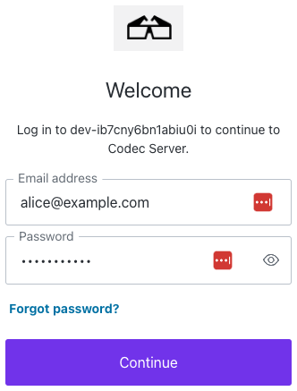

#### Alice is authenticated, and in the "Decryptor" role:

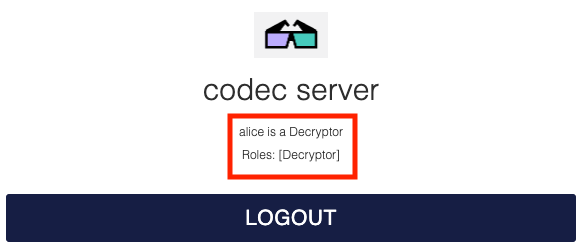

### Temporal UI
Return to https://cloud.temporal.io and refresh the workflow.

#### Workflow View with Decrypted Payloads

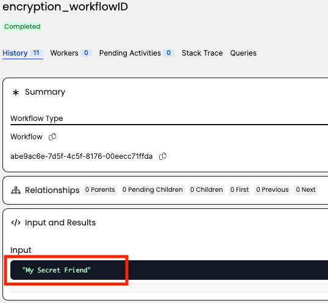

For Alice, the `/decode` endpoint responds with the decrypted payload an a 200 OK message.

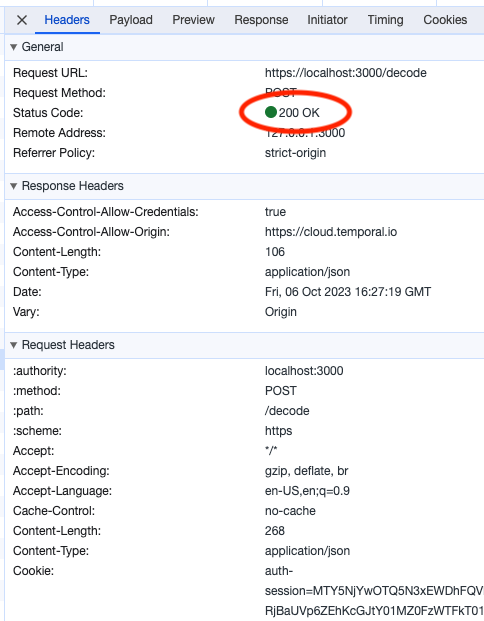
